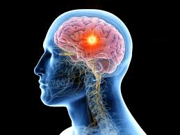

# charcot
> Putting brain images at the fingertips of scientists and researchers. Charcot allows interested parties to request Zips of brain image data by interactively building cohorts via a user-friendly graphical interface.




<!-- TOC titleSize:2 tabSpaces:2 depthFrom:1 depthTo:6 withLinks:1 updateOnSave:1 orderedList:0 skip:0 title:1 charForUnorderedList:* -->
## Table of Contents
* [charcot](#charcot)
    * [Overview](#overview)
    * [Install](#install)
      * [Requirements](#requirements)
      * [Steps](#steps)
    * [Usage](#usage)
    * [Architecture](#architecture)
    * [Developers](#developers)
<!-- /TOC -->

### Install
The below steps assume MacOS or Unix-like systems only.

#### Requirements
1. [nvm](https://github.com/nvm-sh/nvm#profile_snippet)
   ```
   curl -o- https://raw.githubusercontent.com/nvm-sh/nvm/v0.39.0/install.sh | bash
   ```
2. `node 18`, using `nvm` command that you installed above,
   ```
   nvm install node@16
   ```
3. [git](https://git-scm.com/book/en/v2/Getting-Started-Installing-Git)
4. The `aws cli`. The steps on how to do this are beyond the scope of this document, but on mac you can do `brew install aws`
5. Admin level key id/key screte pair for both Mt Sinai ODP and paid accounts. The AWS in profiles respectively have to be named `mssm` and `mssm-odp` in your `~/.aws/credentials` file. You can use `aws configure` from the command line to configure access to your AWS accounts.
6. [zx](https://www.npmjs.com/package/zx)
7. Java OpenJDK 17 or above
   1. Install `SDKMAN!` as per [here](http://sdkman.io/install)
   2. Run command `sdk use java 17.0.4-tem` to activate Java 17 in your system (any Java version >= 17 will do)
8. [Maven](https://maven.apache.org/install.html)
9. [Docker](https://docs.docker.com/engine/install/)

#### Steps
_In the steps below, replace `<env>` with the stage name. When running locally the default stage name will be your username, so use that as the value of `<env>`._

1. Git clone repo at https://github.com/NBTR-MSSM/charcot,
   `git clone git@github.com:NBTR-MSSM/charcot.git`
2. Install dependencies by running this command in the parent folder of the code cloned above, `npm install`
3. Build the fulfillment module Java code,
   ```
   cd fulfillment/
   mvn -U clean install
   ```
4. Deploy the app to the cloud, `AWS_PROFILE=<your AWS profile> npx sst deploy:<env>`
5. Populate image metadata in AWS: `script/post-metadata.mjs -s <env>`

### Usage
Once deployment completes, open https://<stage>.mountsinaicarcot.org/.

### Architecture
Refer to [this](./doc/architecture/README.md) document.

### Developers
Take a look at the [contributing](./CONTRIBUTING.md) and [developer](./doc/developer/README.md) guides if you plan to develop for charcot.
